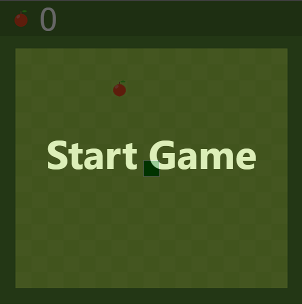
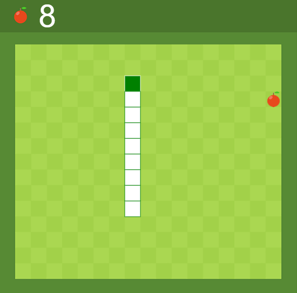
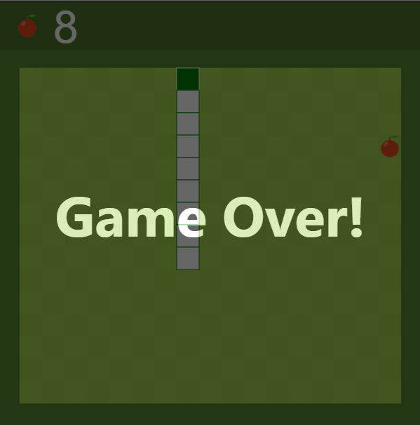

# Snake-Js
A simple implementation of snake game using pure JavaScript.

## Start Game 

Press **up** key or other control key.

1. **up** or **W**      ==> SNAKE MOVE UP
1. **down** or **S**    ==> SNAKE MOVE UP
1. **left** or **A**    ==> SNAKE MOVE UP
1. **right** or **D**   ==> SNAKE MOVE UP

## Game Started

## Game Over

When the snake collision himself or touch the border.

To restart click everywhere on the screen or click space key.

