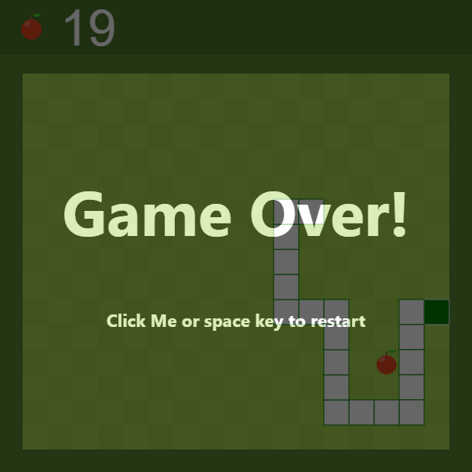

# Snake-Js
A simple implementation of snake game using pure JavaScript.

## Start Game 

Press **up** key or other control key.

1. up
1. down
1. left
1. right

## Game Started

## Game Over

When the snake collision himself or touch the border.

